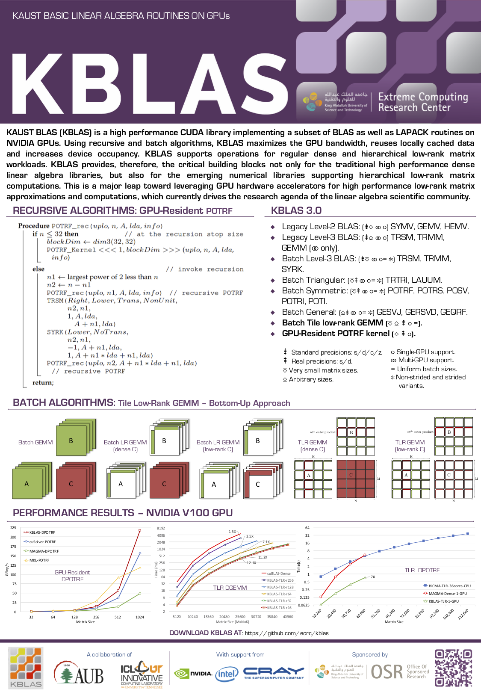
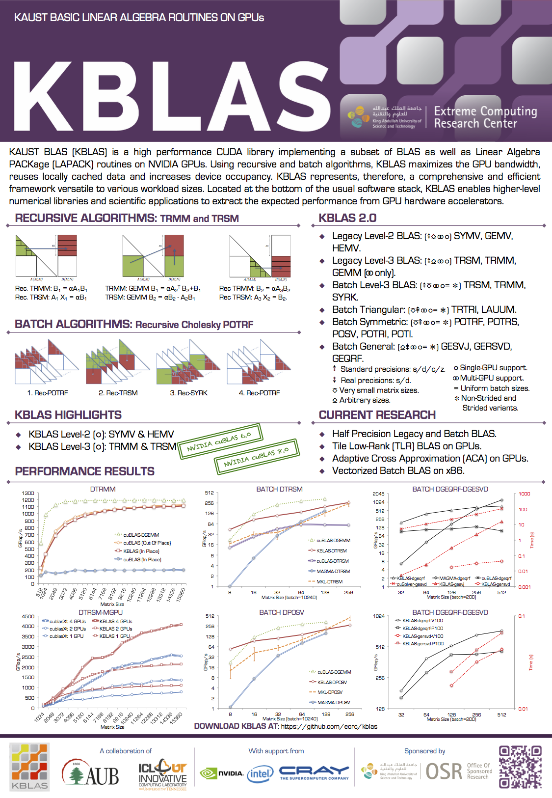

# kblas-gpu

What is KBLAS
=============

KAUST BLAS (KBLAS) is a high performance CUDA library implementing a subset of BLAS as well as Linear Algebra PACKage (LAPACK) routines on NVIDIA GPUs. Using recursive and batch algorithms, KBLAS maximizes the GPU bandwidth, reuses locally cached data and increases device occupancy. KBLAS supports operations for regular dense and hierarchical low-rank matrix workloads. KBLAS provides, therefore, the critical building blocks not only for the traditional high performance dense linear algebra libraries, but also for the emerging numerical libraries supporting hierarchical low-rank matrix computations. This is a major leap toward leveraging GPU hardware accelerators for high performance low-rank matrix approximations and computations, which currently drives the research agenda of the linear algebra scientific community.

KBLAS is written in CUDA C. It requires CUDA Toolkit for installation.

Current Features of KBLAS
=========================

KBLAS provides highly optimized routines from various levels of BLAS and LAPACK, including:

1. Legacy Level-2 BLAS: (⇟⎐ ⚭ ⚬) SYMV, GEMV, HEMV.
2. Legacy Level-3 BLAS: (⇟⎐ ⚭ ⚬) TRSM, TRMM, GEMM (⚭ only).
3. Batch Level-3 BLAS: (⇟⎏ ⚭ ⚬= ✼) TRSM, TRMM, SYRK.
4. Batch Triangular: (⎏⇞ ⚭ ⚬= ✼) TRTRI, LAUUM.
5. Batch Symmetric: (⎏⇞ ⚭ ⚬= ✼) POTRF, POTRS, POSV, POTRI, POTI.
6. Batch General: (⎐⇟ ⚭ ⚬= ✼) GESVJ, GERSVD, GEQRF.
7. Batch Tile low-rank GEMM (⎏ ⎐ ⇞ ⚬ =).
8. GPU-Resident POTRF kernel (⎐ ⇞ ⚬).

⇟ Standard precisions: s/d/c/z.
⇞ Real precisions: s/d.
⎏ Very small matrix sizes.
⎐ Arbitrary sizes.
⚬ Single-GPU support.
⚭ Multi-GPU support.
= Uniform batch sizes.
✼ Non-strided and strided variants.

Installation
============

KBLAS installation requires a recent **make**.
To build KBLAS, please follow these instructions:

1.  Get KBLAS from git repository

        git clone git@github.com:ecrc/kblas-gpu

    or

        git clone https://github.com/ecrc/kblas-gpu

2.  Go into KBLAS folder

        cd kblas-gpu

3.  Edit file make.inc to:
    - Enable / disable KBLAS sub modules (_SUPPORT_BLAS2_, _SUPPORT_BLAS3_, _SUPPORT_BATCH_TR_, _SUPPORT_SVD_, _SUPPORT_TLR_).
    - Enable / disable usage of third party libraries (_USE_MKL_, _USE_MAGMA_) for performance comparisons.
    - Provide path for third party libraries if required (_CUB_DIR_, _MAGMA_ROOT_).
    - Specify CUDA architecture to compile for (_CUDA_ARCH_).

    or

    - Provide equivalent environment variables.

4.  Build KBLAS

        make

5.  Build local documentation (optional)

        make docs

Testing
=======

The folder 'testing' includes a set of sample programs to illustrate the usage of each KBLAS routine, as well as to test the performance 
and accuracy of such routines against other vendor libraries.

Related Publications
====================

1. A. Charara, D. Keyes, and H. Ltaief, Tile Low-Rank GEMM Using Batched Operations on GPUs
*24th International Conference on Parallel and Distributed Computing, Turin, Italy, August 27 - 31, 2018, Proceedings*, http://hdl.handle.net/10754/627402, 2018.

2. A. Charara, D. Keyes, and H. Ltaief, Batched Triangular Dense Linear Algebra Kernels for Very Small Matrix Sizes on GPUs
*ACM Trans. Math. Software (accepted)*, http://hdl.handle.net/10754/622077, 2018.

3. W. H. Boukaram, G. Turkiyyah, H. Ltaief, and D. Keyes, Batched QR and SVD algorithms on GPUs with applications in hierarchical matrix 
compression, *J. Parallel Comput.*, Special Edition, 2017.

4. A. Abdelfattah, D. Keyes, and H. Ltaief, KBLAS: an optimized library for dense matrix-vector multiplication on GPU accelerators, *ACM 
Trans. Math. Software 42(3)*, DOI: http://dx.doi.org/10.1145/2818311, 2016.
 
5. A. Charara, D. Keyes, and H. Ltaief, A Framework for Dense Triangular Matrix Kernels on Various Manycore Architectures, *Concurr. 
Comput.: Prac. Experience*, http://hdl.handle.net/10754/622077, 2016.

6. A. Charara, H. Ltaief, and D. Keyes, Redesigning Triangular Dense Matrix Computations on GPUs, *22nd International Euro-Par Conference 
on Parallel and Distributed Computing*, Best papers, DOI: http://dx.doi.org/10.1007/978-3-319-43659-3_35, 2016.

7. A. Abdelfattah, H. Ltaief, and D. Keyes, High Performance Multi-GPU SpMV for Multi-component PDE-Based Applications, *21st 
International Euro-Par Conference on Parallel and Distributed Computing*, 2015.

8. A. Abdelfattah, D. Keyes, and H. Ltaief, Systematic Approach in Optimizing Numerical Memory-Bound Kernels on GPU, *18th 
International Euro-Par Conference on Parallel and Distributed Computing*, 2013.

9. A. Abdelfattah, J. Dongarra, D. Keyes, and H. Ltaief, Optimizing Memory-Bound SyMV Kernel on GPU Hardware Accelerators, *10th 
International Conference High Performance Computing for Computational Science - VECPAR*, DOI: http://dx.doi.org/10.1007/978-3-642-38718-0_10, 2012.

Handout
=======

